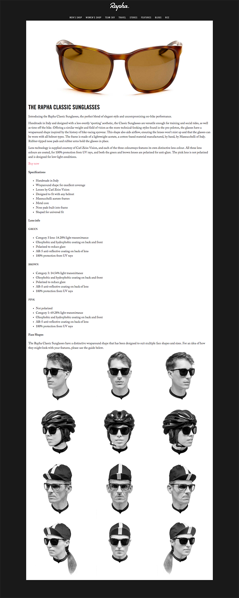

# Rapha Front End Developer Task

Using the assets here, style up the content to produce a layout to sell the sunglasses.

The style and functionality is up to you, but bear in mind it should fit with the Rapha brand. Show off your CSS and JS skills.

We’d like you to use JS to create something similar _[this fancy hover over the face thing](http://hankjobenhavn.com/#/eyewear/state)_ to show the sunglasses at different angles.

**NB:** There are additional inline comments within `index.html`.

## Assets

All the copy is in `index.html`

There are a bunch of images to use within `img/` — location photography, packaging, details and colour ways.

You can use grunt to compile your `.scss` or just edit the `.css` file

## Grunt

To use Grunt you must have [Node.js](https://nodejs.org/en/) installed as well as the [Grunt CLI](http://gruntjs.com/getting-started)

If you have them already just run `npm install` to get the project setup and then run grunt to get going.

## Preview

